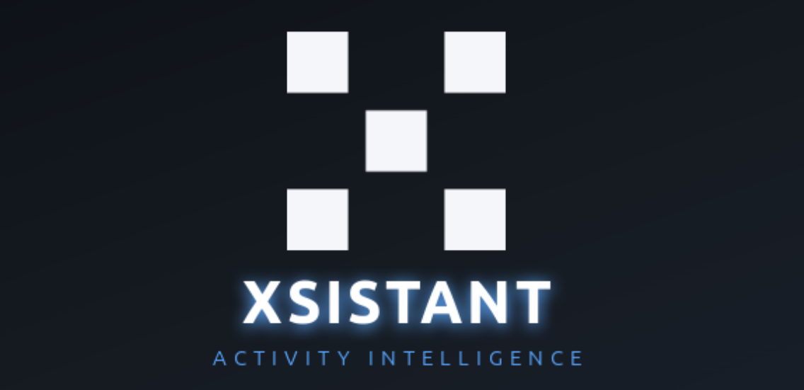

<p align="center">
  
</p>

<h1 align="center">Xsistant</h1>
<p align="center"><em>Activity-aware agent for Ubuntu/GNOME that turns keyboard, mouse and window focus into per-project time.</em></p>

<p align="center">
  <a href="https://github.com/overthelex/aisisstant/releases"></a>
  <a href="https://github.com/overthelex/aisisstant/actions"></a>
  <a href="https://github.com/overthelex/aisisstant/blob/master/debian/copyright"></a>
  
</p>

<p align="center">
  
  
  
  
  
  
  
  
  
  
  
  
  
  
</p>

---

## What it does

Xsistant runs as a `systemd --user` daemon and continuously samples three streams:

- **Keyboard & mouse** — raw events from `/dev/input/event*` via `evdev` (app-agnostic, count-based).
- **Focused window** — AT-SPI over D-Bus (`pydbus`), with `switchamba` as fallback when AT-SPI is unavailable.
- **Microphone** — PipeWire/PulseAudio state via D-Bus.

Everything lands in PostgreSQL with second-level resolution. A scorer aggregates the streams into an `activity_scores` table, so you get an honest per-minute view of when you were actually working versus the machine was just on.

A GNOME Shell top-bar indicator shows live activity, lets you pause tracking, and opens a stats panel. A GTK4/libadwaita setup wizard handles first-run configuration and a regular settings UI.

## Project attribution (the interesting part)

Titles lie. Ten IDEs and terminals all look like `Code — file.py` in the window title, and parsing that is fragile.

Xsistant attributes activity to a project by reading **the focused process's working directory** (`/proc/<pid>/cwd`), walking child processes when the focus is a terminal/IDE, and matching against known project roots. Out-of-project activity is stored as `null` rather than faked into nearby sessions — reports stay honest.

## Install

### From the built `.deb`

```bash
# Grab the latest release
gh release download --repo overthelex/aisisstant --pattern '*.deb'
sudo apt install ./aisisstant_*.deb
```

### From source

```bash
git clone https://github.com/overthelex/aisisstant.git
cd aisisstant
./scripts/install.sh
```

The install script: installs Python deps, brings up PostgreSQL via `docker compose`, copies the GNOME extension, registers the `systemd --user` service and starts it.

Enable the top-bar indicator:

```bash
gnome-extensions enable aisisstant-tracker@vovkes
```

## Usage

- `aisisstant-setup` — GUI wizard / settings window
- `aisisstant-report` — per-project time report (CLI)
- `aisisstant-stats` — DB activity counters for the top-bar indicator
- `systemctl --user status aisisstant` — service status
- `journalctl --user -u aisisstant -f` — live logs

## Architecture

```
┌────────────────────────────────────────────────────────────┐
│                  systemd --user: aisisstant                │
│                                                            │
│  ┌──────────┐  ┌──────────┐  ┌──────────┐  ┌──────────┐    │
│  │ keyboard │  │  mouse   │  │  window  │  │   mic    │    │
│  │  evdev   │  │  evdev   │  │  AT-SPI  │  │  D-Bus   │    │
│  └────┬─────┘  └────┬─────┘  └────┬─────┘  └────┬─────┘    │
│       └──────┬──────┴─────────────┴────────────┘           │
│              ▼                                             │
│        ┌───────────┐      ┌────────────────┐               │
│        │  scorer   │──────▶ activity_scores│               │
│        └───────────┘      │   (Postgres)   │               │
│              │            └────────┬───────┘               │
│              ▼                     │                       │
│      ┌───────────────┐             │                       │
│      │  report.json  │◀────────────┘                       │
│      │ /run/user/…   │                                     │
│      └───────┬───────┘                                     │
└──────────────┼─────────────────────────────────────────────┘
               │
               ▼
    ┌─────────────────────┐        ┌──────────────────────┐
    │ GNOME Shell ext.    │        │  GTK4 setup/settings │
    │ (top-bar indicator) │        │     aisisstant-setup │
    └─────────────────────┘        └──────────────────────┘
```

## CI/CD

`.github/workflows/ci-deploy.yml` runs on a **self-hosted runner** (needed for `systemctl --user` + D-Bus session) with three jobs:

1. **test** — `pytest` on every push and PR.
2. **deploy** — on push to `master`, updates the systemd unit, copies the GNOME extension, restarts the service and health-checks it.
3. **release** — generates a CalVer tag (`YYYY.MM.DD[.N]`), syncs versions in `pyproject.toml` / `aisisstant-setup` / `debian/changelog`, builds the `.deb` via `dpkg-buildpackage` and publishes a GitHub Release with the artifact.

## Roadmap

- **Plane integration** — automatic worklog posting. Xsistant already knows which project you're in; the next layer is matching the active **task** (by branch name `feature/PROJ-123-…`, by IDE window title, or by explicit pick in the top-bar) and writing minutes back to Plane via its API. No more manual time entry.
- Language-model summary of per-day activity.
- Wayland-native window tracking path when AT-SPI is unavailable.

## Tech stack

- **Runtime:** Python 3.12 · `asyncio` · `asyncpg` · `evdev` · `pydbus`
- **Storage:** PostgreSQL 16 in Docker Compose
- **UI:** GTK4 · libadwaita · GNOME Shell extension (JS)
- **System:** `systemd --user` · D-Bus (AT-SPI) · `switchamba` fallback
- **Packaging:** `dpkg-buildpackage` → native `.deb`
- **CI/CD:** GitHub Actions on a self-hosted runner · CalVer versioning

## License

MIT. See [debian/copyright](debian/copyright).

---

<sub>Built on Ubuntu by <a href="https://github.com/overthelex">Volodymyr Ovcharov</a> & Claude Code.</sub>
